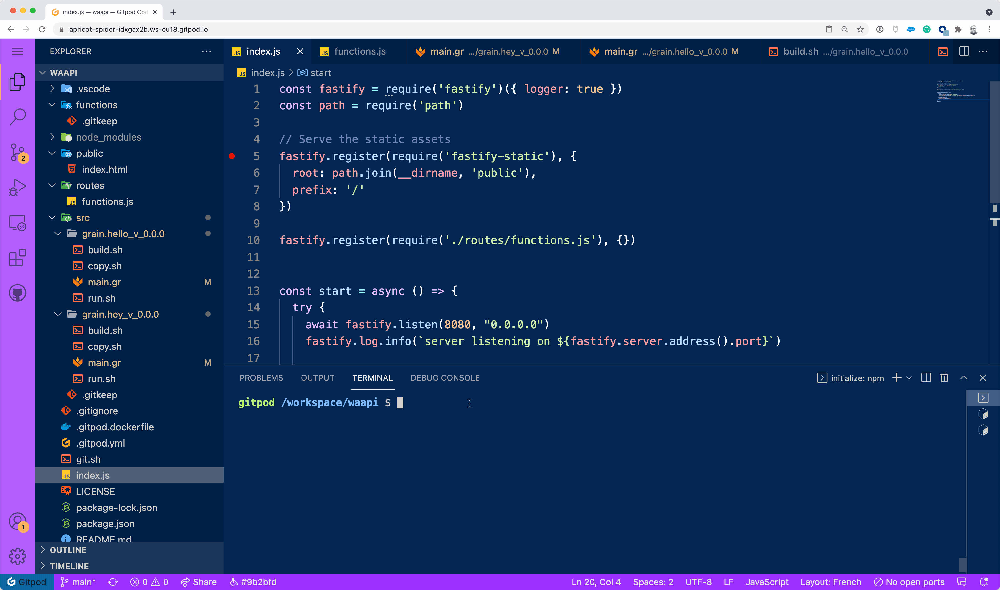

# WaAPI

*WebAssembly Application Programming Interface*



[](https://gitpod.io/#https://github.com/k33g/waapi)

## Prerequisites

- Grain compiler (or other Wasm compiler, more examples to come)
- NodeJS (run `npm install to install dependencies`)
- Wasmer

🖐 if you open this project with [GitPod](http://gitpod.io/), the first time, you can take a 🍵. When building the docker image (see `.gitpod.dockerfile`), I clone the [Grain](https://github.com/grain-lang/grain) project and build the compiler from source. But you'll get all the dependencies, Grain, Wasmer, Fastify; ...

## Run WaAPI

```bash
npm start
```

## Compile an deploy a wasm function
> See sample in `./src`

- A function must be named like this: `<function-name>_v_<version>` (ex: `grain.hello_v_0.0.0`)
- Build a function: `grain compile main.gr -o <function-name>_v_<version>.wasm`
- Copy the wasm file to the `./functions` directory

## Call a function

```bash
http POST http://localhost:8080/functions/grain.hey/0.0.0 name=Bob
```

If you use GitPod:
```bash
http POST $(gp url 8080)/functions/grain.hey/0.0.0 name=Bob
```
